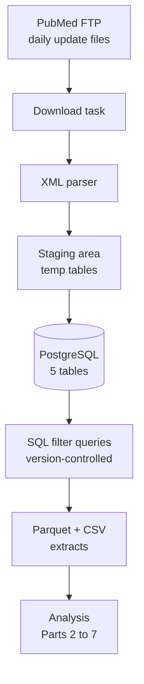

> *Part 1 of the series: **[From Open Source Data to Powerful Insights on Cystic Fibrosis Research Collaboration](/blog/cf-research-network-analysis/)***

> ***TL;DR:*** *This post is about the plumbing behind the whole series: the data flywheel that turns PubMed's firehose into a clean local mirror of biomedical literature, and the frozen snapshot of that mirror the rest of this series runs on. If you came here for findings, you probably want [Part 5]() or the [series landing page](/blog/cf-research-network-analysis/). If you want to see how the sausage is made, read on.*

---

Data is the foundation that every post in this series stands on. So before writing a single line of analysis code, I built a local mirror of PubMed that refreshes itself every week, and some SQL that distills 26 million indexed articles (everything in PubMed from 2000 onward) down to the 11,500 that actually matter for Cystic Fibrosis research. This post is that build, and an honest look at the choices that went into it.

## The Data: 26 Million Articles in a Local PostgreSQL Database

The stack has three pieces: a data source ([PubMed](https://en.wikipedia.org/wiki/PubMed)), a database (Postgres), and a scheduler ([Prefect](https://www.prefect.io/)). I'll take them in that order.

### Why PubMed

PubMed is the natural choice, and crucially, it's open source. It's maintained by the [National Library of Medicine](https://www.nlm.nih.gov/), covers well over 40 million biomedical articles, and ships with structured metadata (authors, affiliations, publication types, and the [MeSH](https://en.wikipedia.org/wiki/Medical_Subject_Headings) topic tags trained indexers at the NLM assign to every paper), all free to download in bulk. I ingest everything from the year 2000 onward, which keeps the processing time and on-disk volume manageable without losing anything this project cares about. Alternatives like Google Scholar, Scopus, Web of Science, and Semantic Scholar exist, but none of them work for a project that wants to ingest the full index, publish its data lineage openly, and rely on human-curated topic tags.

### The Infrastructure

The server itself is a Beelink mini-PC I bought with Windows preinstalled, wiped, and reloaded with Ubuntu. It sits in a corner of my desk running [PostgreSQL](https://en.wikipedia.org/wiki/PostgreSQL), Python, and Prefect, reachable over SSH.

Prefect is the scheduler. Think of it as a patient robot that wakes up once a week, pulls the latest PubMed updates, loads them into Postgres in the right order, and retries anything that fails. It's similar in spirit to Apache Airflow but lighter, which fits my server setup well.

A single Postgres instance on my Linux server keeps costs near zero and keeps every moving part in one place. The Prefect flow runs once a week, pulls PubMed's daily update files, parses the XML, and upserts the changes into the five tables, so the database is never more than seven days behind live PubMed and new papers show up without me touching anything.

One thing worth flagging early: this series is not a live analysis. I froze a snapshot of the filtered data at the start and the rest of the posts run against that one fixed export, so the numbers you'll read in later parts don't move as PubMed updates. The reason the ETL keeps running every week anyway is that the mirror is an investment, not a one-off. I want to keep it current so I can build more cool stuff on top of it later without rebuilding the plumbing from scratch.

The schema is five tables joinable on `pmid`, shaped around the kinds of analytical queries this project actually runs.

- **articles**: 26M+ rows. Every paper in PubMed with its title, abstract, publication year, journal, DOI, and keywords.
- **article_authors**: Who wrote each paper, in what order, with their ORCID (if they have one) and affiliation text.
- **article_mesh_headings**: The standardized topic tags assigned to each article by human indexers (more on this below).
- **article_publication_types**: Whether it's a journal article, clinical trial, review, case report, etc.
- **article_chemicals**: Substances and drugs mentioned in each paper.

PubMed is a living dataset. Articles get revised, retracted, and re-indexed all the time. A 2022 paper can grow new MeSH tags in 2024. The weekly flow has to absorb all of that without corrupting the mirror's internal consistency across the five tables.

### The Weekly ETL

Here's the architecture, from NCBI's FTP all the way to the Parquet extracts later posts in this series read from:

Prefect wakes up once a week, grabs that week's NCBI update files, and walks them through the task graph in order. Downloads retry on their own if the network hiccups, and the integrity checks at the end halt the run if anything looks wrong (dangling foreign keys, row-count drifts, duplicate PMIDs) instead of quietly corrupting state. The extraction step that produces the Parquet files is separate: it runs when I ask for it, not on every refresh.

---

## Filtering 26 Million Articles Down to 11,500

With the full PubMed database sitting in Postgres, we can get surgical with the filtering. The funnel has three steps.

**Step 1: Disease identification via MeSH.** PubMed doesn't tag articles with plain-text disease names. Instead, it uses the [Medical Subject Headings (MeSH)](https://en.wikipedia.org/wiki/Medical_Subject_Headings) vocabulary, a curated list of around 30,000 terms that trained indexers at the NLM assign to every article they catalog. MeSH matters for this project because a MeSH tag is effectively a human indexer's vote that the article is actually *about* the topic, not just mentioning it in passing. A keyword search for "cystic fibrosis" would happily include papers that say things like "unlike cystic fibrosis, this disease..." or list CF in a roll-call of genetic disorders. Those are irrelevant for our analysis. MeSH filtering is dramatically more precise, and it is the backbone of Step 1.

**Step 2: Publication type.** PubMed categorizes publications into roughly 80 types, and they are not all equal for understanding collaboration. We want evidence of original scientific teamwork: journal articles, clinical trials (all phases), observational studies, reviews, meta-analyses, case reports, and practice guidelines. These are the publication types where multiple researchers genuinely *worked on something together*. I excluded commentaries, letters to the editor, editorials, and news articles (over 2,700 items in total) because those represent discourse, not collaboration. A letter to the editor listing two co-authors doesn't mean those two people actually did research together, and treating it as collaboration would create false edges in the network. This is honestly the step I iterated on quite a bit. What counts as "real collaboration" is a judgment call.

**Step 3: Time window.** I set the window to 2015 through 2025 for two reasons that conveniently line up:

- **Data quality.** PubMed's affiliation coverage crosses 80% around 2015. Before that, too many authors lack institutional information, and since I need to know *where* each researcher works (not just *who* they are), going further back would mean losing a huge chunk of the data.
- **Scientific significance.** 2015 marks the approval of Orkambi, the first broadly accessible CFTR modulator. 2019 marks Trikafta. Those two drugs define the two therapeutic eras the whole series compares, and [Part 5]() is where that before-and-after split gets turned into an actual measurement. The goal is to make sure both sides of that split sit on clean, consistently filtered data.

After the funnel runs: **11,528 articles, 85,194 author-article pairs, spanning 11 years across two therapeutic eras**.

Here's what the publication volume looks like year by year:

<iframe src="{{ '/assets/plotly/eda_publication_timeline.html' | relative_url }}" frameborder='0' scrolling='no' height="510px" width="100%" style="border: 1px solid #ddd; border-radius: 5px;"></iframe>

The blue bars (Era 1) are clearly smaller than the orange bars (Era 2). Publication volume climbed sharply after Trikafta's 2019 approval, but the trend was already accelerating in the late Era 1 years, a reminder that the modulator revolution was building momentum before the drug that became its headline.

And this chart shows how the research themes themselves shifted between eras:

<iframe src="{{ '/assets/plotly/eda_topic_streams.html' | relative_url }}" frameborder='0' scrolling='no' height="560px" width="100%" style="border: 1px solid #ddd; border-radius: 5px;"></iframe>

CFTR Modulator topics (blue) surge upward starting around 2019, while infection research (orange) holds relatively steady. Quality of Life research (green) climbs gradually across the whole period. That's the two-eras story told through data: the research community literally pivoted its focus.

---

## What the Raw Data Looks Like

Here's a real example of what PubMed hands over for a single article, so you can see what I'm actually working with:

**PMID 33160331**, a nephrology case report:
- **Authors**: 8 authors, each with a name, a position (0-indexed, so the first author is position 0), initials, and an affiliation text string.
- **Affiliations**: Free text like *"The Nephrology Group Inc, 568 E Herndon Ave STE 201, Fresno, CA 93720"*, which mashes institution name, street address, city, state, and zip code into one unparseable line.
- **MeSH terms**: 14 descriptors, 3 flagged as major topics (meaning they're central to the paper, not just mentioned).
- **Publication types**: Journal Article, Case Reports.

The affiliations are by far the hardest part of all of this. They aren't structured fields with labels for "institution", "city", "country". They're whatever the journal's submission system happened to collect on the day the author submitted the paper, and the variation is genuinely absurd. Two affiliation strings at opposite ends of the spectrum:

> *Hospital for Sick Children, Toronto, Ontario, Canada.*

> *Division of Pediatric Pulmonology, Department of Pediatrics, UNC School of Medicine, Chapel Hill, NC 27599, USA; Marsico Lung Institute / UNC Cystic Fibrosis Research Center, The University of North Carolina at Chapel Hill, Chapel Hill, NC 27599, USA. Electronic address: someone@email.unc.edu.*

Both of those point at legitimate CF research institutions. The first is a clean organization name plus a city. The second is a six-level department hierarchy, a street address, a zip code, a joint appointment at a named research center, and an email stuck on the end for good measure. Some affiliations are in French, Turkish, or Chinese. Some list three institutions separated by semicolons because the researcher holds multiple appointments. And there are 57,675 distinct affiliation strings across the dataset, all of which eventually need to resolve to roughly 5,800 actual organizations.

Parsing a handful of affiliations by hand is a weekend. Parsing 57,000 of them is a career. That is the problem [Part 2]() solves.

---

## The Extraction Pipeline

With the filters defined in SQL, the extraction pipeline itself is short. For this series, I took one filtered snapshot at the start of the project, and every number in every later post comes from that one snapshot. That's intentional: Parts 2 through 7 aren't chasing a moving target.

The pipeline:

1. Connect to PostgreSQL via Unix socket.
2. Read the SQL filter definitions, parameterized with year ranges.
3. Run the articles query, save as [Parquet](https://en.wikipedia.org/wiki/Apache_Parquet).
4. Run the authors query, save the same way.

The output:
- **11,528 articles** with title, abstract, pub_year, journal, DOI, keywords.
- **85,194 author-article pairs** with PMID, author position, name, ORCID, affiliations.

I went with Parquet as the primary format on purpose. It's a columnar storage format that preserves data types (integers stay integers, arrays stay arrays), compresses well (20MB CSV becomes 6MB Parquet), and reads about 10x faster than CSV for the kind of column-level queries downstream analysis actually runs.

---

## What's Next

Two problems stand between the raw data and any real network analysis.

1. **The institution problem**: 57,675 distinct affiliation strings that need to be resolved to roughly 5,800 actual research organizations. The same hospital shows up as "The Hospital for Sick Children", "SickKids", "Hospital for Sick Children, Toronto", and a dozen other variants. If we don't fix this, one hospital becomes 12 disconnected nodes in the network, and the analysis falls apart.

2. **The author problem**: 42,949 unique name combinations that need to be resolved to about 39,000 actual people. "Smith, J" could be 4 different researchers at 4 different institutions. "Gokcen" and "Gökçen" are the same person with and without Turkish diacritics. If we get this wrong, we either merge two different people into one (creating fake collaborations) or split one person into two (losing real ones).

Both problems are forms of entity resolution. [Part 2]() tackles the institution version using LLM-based affiliation parsing and a geo-search API. [Part 3]() tackles the author version with a temporal-aware disambiguation algorithm that achieves F1=0.9996 against ground truth.

---

*Next: [Part 2: Resolving 57,000 Affiliation Strings to 5,800 Research Organizations]()*

