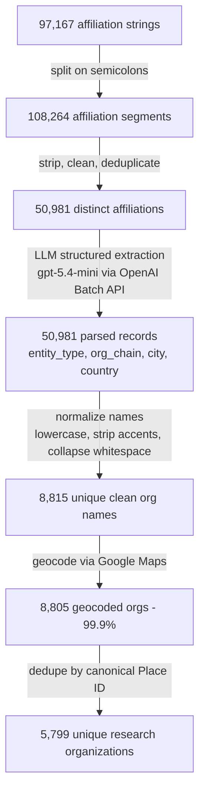

> *Part 2 of the series: **[From Open Source Data to Powerful Insights on Cystic Fibrosis Research Collaboration](/blog/cf-research-network-analysis/)***

---

## The Problem

A co-authorship network needs each institution to be a single node. Not 12 variants of the same hospital pretending to be 12 different places. If the graph thinks "The Hospital for Sick Children" and "SickKids" are two organizations, the whole collaboration analysis falls apart: every author with a dual affiliation fractures, every research cluster gets split in half, and the story about who works with whom becomes a story about spelling.

Here is what the same hospital actually looks like in PubMed affiliations:

```
"Division of Pulmonary Medicine, Department of Pediatrics, Hospital for Sick Children, Toronto, ON, Canada"
"SickKids Research Institute, Peter Gilgan Centre for Research and Learning, Toronto, Canada"
"The Hospital for Sick Children, University of Toronto, Toronto, ON, Canada M5G 1X8; felix.ratjen@sickkids.ca"
```

And the University of Alabama at Birmingham, four different ways:

```
"University of Alabama at Birmingham"
"University of Alabama at Birmingham (UAB)"
"University of Alabama at Birmingham (UAB) School of Medicine"
"UAB School of Medicine"
```

Part 1 left off with 97,167 raw affiliation strings attached to authors. This post is about what it takes to turn that pile of free text into **5,799 real research organizations** with canonical names, geographic coordinates, and stable IDs. The short version: a structured-output LLM pipeline, a proper MLflow-tracked evaluation, and a geo-search API doing the final dedup.

---

## A Baseline Before Reaching for LLMs

In the pre-LLM era, this would have been a non-trivial NLP project: tokenizers, hand-crafted similarity features, maybe a CRF for structured parsing, weeks of iteration on rules and thresholds. Today, an LLM with a structured output schema is the obvious choice, and the rest of this post is about doing that well. But "obvious" is not the same as "measured", and I still wanted to know what a well-tuned traditional approach would actually hit on this data so I had a real baseline to compare against.

For a gold dataset, I used the ORCID subset. The idea: if two author records share an ORCID, their affiliations should resolve to the same institution. That gives a real ground-truth signal for institution consistency without any manual labeling. I then ran five traditional entity-resolution strategies against it: token-based Jaccard, structured parsing into a key and matching on it, combined key + city + country matching, priority-based institution extraction, and a city + institution composite.

The best strategy hit **57.7% consistency**. Or put less charitably, roughly one in two institution assignments would be wrong, and every error creates a fake node in the network.

The fundamental problem is that affiliations are natural language, written by humans, for humans, not machines. "School of Medicine" appears 598 times across dozens of different universities. No amount of string similarity can tell you *which* School of Medicine without understanding the surrounding text. That is exactly what LLMs excel at, and that is the baseline the rest of this post is measured against.

---

## The LLM Pipeline

Instead of pattern-matching raw text, use an LLM to do what humans do naturally: read the affiliation and pull out the structured parts. Modern Large Language Models have seen enough university names, hospital hierarchies, and address formats that "CHU de Toulouse - Hopital des Enfants" is not a mystery to them even though it is in French and uses abbreviations.

Here is the full flow, picking up right where Part 1 left off:



That is a 94% reduction from raw affiliation strings to unique orgs. Every step in the middle matters, and the hardest one by far is the LLM extraction.

### Structured Output, Not Freeform Text

The LLM is not asked to "summarize" or "describe" the affiliation. It is asked to return a Pydantic-validated JSON object with a fixed schema:

- **`org_chain`**: an ordered list of organizational units from innermost to outermost, e.g. `[Division → Department → Hospital → University]`. Each entry is typed (`department`, `division`, `school`, `hospital`, `university`, `company`, `government`, `other`, ...).
- **`top_parent_org`**: the single parent institution that becomes the dedup key downstream.
- **`entity_type`**: one of `academic | industry | hospital | government | nonprofit | unknown`.
- **`city`, `state_province`, `country`, `postal_code`**: geographic anchors.
- **`email`, `phone`, `street_address`**: contact fields that get split out cleanly so they never pollute the org name.
- **`unclassified_text`**: a catch-all for fragments that do not fit anywhere else ("Now at", "Electronic address:", footnote markers, etc.).

Structured output is enforced differently by each provider. OpenAI validates the JSON schema at decoding time and returns typed objects. Anthropic uses forced tool calls where the tool's input schema is the Pydantic JSON schema. Gemini uses its own response-schema feature. Each path has quirks, but all three guarantee a valid object on every call, which means downstream code never has to defensively parse half-broken JSON.

### The Prompt

The prompt is a Jinja2 template that combines a role statement, the target JSON schema, a rule list, entity-type guidance, and four few-shot examples. Here are the key pieces.

**System message:**

```text
You are an expert biomedical affiliation parser.

Your task is to convert a PubMed affiliation into a structured JSON object.
The input will contain exactly one affiliation, which may be academic,
hospital/medical center, industry/pharma/biotech, government/public research,
nonprofit, ambiguous, malformed, or not a real affiliation.

You must output only valid JSON that matches the target schema exactly.
```

**Target schema:**

```json
{
  "raw_affiliation": "string",
  "entity_type": "academic | industry | hospital | government | nonprofit | unknown",
  "org_chain": [
    {
      "type": "department | division | center | institute | laboratory | school | clinic | hospital | university | company | government | other",
      "name": "string"
    }
  ],
  "top_parent_org": "string or null",
  "city": "string or null",
  "state_province": "string or null",
  "country": "string or null",
  "postal_code": "string or null",
  "street_address": "string or null",
  "email": "string or null",
  "phone": "string or null",
  "unclassified_text": ["string", "..."]
}
```

**Extraction rules:**

1. Preserve the input exactly in `raw_affiliation`.
2. Keep `org_chain` in the same order as the source text.
3. Do not infer missing fields that are not present in the text.
4. Extract street addresses, postal/ZIP codes, email addresses, and phone numbers into their dedicated fields when present. Combine multiple street fragments into a single `street_address` value.
5. Put unresolved text, qualifiers, footnote markers, and anything not fitting the above fields into `unclassified_text`.
6. Use `top_parent_org = null` when no single parent organization can be chosen confidently.
7. Never assume or infer information not explicitly present in the text. If uncertain, leave the field null rather than guess.
8. Return JSON only.

The template also includes entity-type guidance (what separates *academic* from *hospital* from *government*), org-type guidance (the 12 allowed values for `org_chain[].type`), and four few-shot examples chosen to cover the main extraction challenges:

1. A clean academic hierarchy (UAB: Department → Division → School → University)
2. A hospital nested inside a university system (Seattle Children's inside University of Washington)
3. A government agency with a relationship qualifier ("Now at NIH" handled correctly, with "Now at" routed to `unclassified_text`)
4. A degenerate input ("Department of Pediatrics.") where the model returns a partial org_chain and `null` for every other field

Rule 7 is the one that does the most work in practice: *"Never assume or infer information not explicitly present in the text. If uncertain, leave the field null rather than guess."* That single line kills a surprising number of failure modes where the model would otherwise confidently invent a city or country for an ambiguous string.

### One Real Example, End to End

Here is a concrete affiliation from the dataset and what the LLM does with it.

**Input:**
> *"Division of Pulmonary Medicine, Department of Pediatrics, Nationwide Children's Hospital, ED 444 700 Children's Drive, Columbus, OH, 43205, USA, shahid.sheikh@nationwidechildrens.org."*

One string with a three-level hierarchy, a street address, a zip code, a state, a country, and a contact email all mashed together.

**Output:**
```json
{
  "entity_type": "hospital",
  "org_chain": [
    {"type": "division", "name": "Division of Pulmonary Medicine"},
    {"type": "department", "name": "Department of Pediatrics"},
    {"type": "hospital", "name": "Nationwide Children's Hospital"}
  ],
  "top_parent_org": "Nationwide Children's Hospital",
  "city": "Columbus",
  "state_province": "OH",
  "country": "USA",
  "postal_code": "43205",
  "street_address": "ED 444 700 Children's Drive",
  "email": "shahid.sheikh@nationwidechildrens.org"
}
```

The three-level hierarchy comes out in order. `top_parent_org` points at the hospital, which is what the dedup layer needs. Street address, zip code, and email are split cleanly into their own fields so none of them ever end up polluting the institution name.

Two more examples for range. A French academic affiliation with a four-level hierarchy:

> *"L'UNAM Universite, Universite d'Angers, Groupe d'Etude des Interactions Hote-Pathogene, EA 3142, Angers, France"*

→ `top_parent_org: "Universite d'Angers"`, `city: "Angers"`, `country: "France"`. Notice the model correctly picks "Universite d'Angers" as the parent even though "L'UNAM Universite" appears first in the text. L'UNAM is a multi-university consortium, not the parent. Getting this right requires knowing how the French academic system works.

A Spanish hospital with an embedded email:

> *"Pediatric Pulmonology Unit, 'Virgen de la Arrixaca' Children's University Hospital, University of Murcia, Murcia, Spain. Electronic address: msolis@um.es."*

→ `top_parent_org: "University of Murcia"`, `email: "msolis@um.es"`, `unclassified_text: ["Electronic address:"]`. The university-hospital relationship gets resolved to the parent university, the email is routed to its own field, and the "Electronic address:" prefix (which is not part of either the org or the email) ends up in the catch-all.

---

## Beyond Vibe Checks: Keeping the LLM Honest With Evals

With the prompt and schema in place, there was still a decision to make that could not be answered by reading documentation: **which model**.

Cost per call across the candidates ranged from about $0.0005 to $0.006, a 12x spread. Across roughly 50,000 affiliations, that is the difference between $25 and $300. Accuracy differences were unknown. Picking the cheapest and hoping would risk thousands of structurally wrong parses. Picking the most expensive and hoping would leave a lot of money on the table for possibly zero accuracy gain. Neither is an acceptable decision when the dollar spend is a real concern.

So I built an eval loop.

### Why Deterministic Scorers, Not LLM-as-Judge

Some evaluation frameworks use one LLM to judge the output of another. That is the right tool when "quality" is subjective (think creative writing or open-ended summaries). It is the wrong tool here, because I have a set of carefully curated ground-truth affiliations where the correct `top_parent_org`, `city`, and `org_chain` are not matters of opinion. For that case, deterministic [precision/recall/F1](https://en.wikipedia.org/wiki/F-score) is strictly more informative:

- **Reproducible**: same score every run on the same data, no sampling variance.
- **Cheaper**: no judge API calls, no extra tokens.
- **Interpretable**: a per-field breakdown tells you exactly which part of the output is failing, not just a single quality number.

### The Gold Dataset

Building ground truth by typing 50 labels from scratch would have been both tedious and slow, so I used a frontier LLM as a fast labeler. I sampled 50 affiliation strings across a set of difficulty buckets, then sent each one through **GPT 5.4** with two jobs: generate a first-pass structured output (`top_parent_org`, `org_chain`, `entity_type`, city, country, etc.), *and* assign a first-pass difficulty bucket. Then I went through every single row, checking every field of the structured output and every bucket assignment, correcting mistakes, resolving ambiguities, and locking down the final labels.

There is an obvious recursive wrinkle to call out: one LLM helped build the ground truth that every other LLM in this evaluation, including another model from the same family, was scored against. That is fine as long as the human review is rigorous, which is why I reviewed every field of every row instead of skimming. The review is load-bearing, not a rubber stamp.

Stratification matters because aggregate F1 can hide catastrophic failure on the hard cases: a model can score 94% overall and still be completely broken on, say, multilingual inputs.

| Bucket | Count | What makes it hard |
|--------|:-----:|--------------------|
| Easy standard | 8 | Straightforward English academic affiliations |
| Deep hierarchy | 7 | 4+ organizational levels nested inside each other |
| Multilingual | 6 | French, German, Turkish, Chinese institution names |
| Industry | 5 | Pharma companies, biotech, CROs |
| Government/nonprofit | 5 | NIH, NHS Trusts, INSERM, national health agencies |
| Address noise | 5 | Street addresses, zip codes mixed into the text |
| Ambiguous/bad | 4 | Truncated strings, typos, genuinely malformed input |
| Has email | 5 | Email addresses embedded in the affiliation |
| Multi-institution | 5 | Two or more institutions in a single string |

### The MLflow Setup

Quick shout-out before getting into the mechanics: [Corey Zumar](https://www.linkedin.com/in/corey-zumar) and the rest of the fantastic folks at [MLflow](https://mlflow.org/) have been absolutely killing it with the GenAI features they have been shipping. Prompt registry, dataset lineage, auto-tracing across providers, `mlflow.genai.evaluate`, GEPA-based prompt optimization: these are genuinely new capabilities that did not exist in a usable form a year ago, and this project leans on all of them. Four features worth calling out:

**Prompt Registry.** The Jinja2 prompt template is registered as a versioned artifact in MLflow with `mlflow.genai.register_prompt("affiliation-parser", ...)`. Re-running the eval only creates a new prompt version if the template text actually changed. Every model run is then tagged with `prompt_uri`, so any metric I look at months later can be traced back to the exact prompt that produced it. No "wait, which prompt was that again" confusion.



**Dataset Lineage.** The 50-example gold set is wrapped as an MLflow dataset (`mlflow.data.from_pandas(...)`) and logged to every run with `mlflow.log_input(mlflow_dataset, context="evaluation")`. MLflow computes a content digest for the dataset, so if someone later asks "what did you actually evaluate on?" the answer is in the run metadata, not my memory.

**Multi-provider autolog.** One line per provider (`mlflow.openai.autolog()`, `mlflow.anthropic.autolog()`, `mlflow.gemini.autolog()`) and every single LLM call during the eval is captured as a trace with token counts, latency, and cost. This is the feature that makes side-by-side multi-provider evaluation cheap to set up: I did not have to write any logging glue for any of the three SDKs.



**Scored evaluation.** The 11 deterministic scorers are wired as `@scorer`-decorated functions and passed to `mlflow.genai.evaluate(data=..., predict_fn=..., scorers=ALL_SCORERS)`. The scorers cover structural validity (`json_parseable`, `pydantic_valid`), geographic accuracy (`city_match`, `country_match`, `state_province_match`, `postal_code_match`, `street_address_match`), and semantic accuracy (`entity_type_match`, `top_parent_org_match`, `org_chain_exact_match`, `org_chain_names_f1`). MLflow handles the fan-out, collects per-example scores, and aggregates into the run metrics automatically.

On top of that, the notebook also prototypes [GEPA (Genetic-Pareto)](https://github.com/google-deepmind/gepa) automatic prompt optimization via `mlflow.genai.optimize_prompts`. Given a scorer signal and the current prompt, GEPA iterates through evaluate → reflect → mutate → select cycles to search for prompt mutations that improve the scores. I did not run it in production for this project, but having the infrastructure already wired means it is a one-afternoon experiment if I ever want to push accuracy further on a specific bucket.

### Six Models, Head to Head

I evaluated six models from three providers:

| Model | org_chain F1 | top_parent_org | entity_type | city | country | Cost/example | Latency |
|-------|:-----------:|:--------------:|:-----------:|:----:|:-------:|:------------:|:-------:|
| **gpt-5.4-mini** | **0.960** | 0.960 | 0.860 | **1.000** | **1.000** | **$0.0005** | **1.3s** |
| gemini-3-flash | 0.895 | 0.880 | 0.820 | 0.920 | 0.940 | $0.0014 | 7.0s |
| gpt-5.4 | 0.940 | 0.980 | 0.860 | 0.980 | 1.000 | $0.0015 | 2.0s |
| claude-haiku-4-5 | 0.936 | 0.880 | 0.820 | 0.980 | 1.000 | $0.0046 | 1.8s |
| gemini-3.1-pro | 0.960 | 0.980 | 0.880 | 0.980 | 1.000 | $0.0058 | 11.0s |
| claude-sonnet-4-6 | 0.955 | 0.960 | 0.900 | 1.000 | 1.000 | $0.0059 | 3.3s |

A few things jumped out of the per-bucket breakdown:

- **City and country extraction was near-perfect across all models.** Those are the easy fields. The real differentiator was `org_chain` and `entity_type`, which require actual language understanding to get right.
- **Government and nonprofit classification was the weakest bucket.** Is INSERM a government agency or a research institute? Is an NHS Trust a hospital or a government body? These are categories where reasonable humans also disagree, so scoring the models against my labels is partly scoring how well they match *my* judgment.
- **Multilingual affiliations separated the pack.** gpt-5.4-mini and Claude Sonnet handled French and German cleanly. Gemini Flash struggled with accent handling and non-Latin scripts.
- **On ambiguous/bad input, the best behavior is to say "I don't know" and return null fields.** Any model that confidently invented a city or country for a truncated string got penalized by the scorers. The explicit anti-hallucination rule in the prompt paid off here.

Prompt caching behavior varied wildly across providers. OpenAI does automatic prefix caching (55% hit rate in production). Anthropic Sonnet requires explicit `cache_control` annotations but works well once set up. Anthropic Haiku silently fails at caching because my prompt (~3,200 tokens) falls below its 4,096-token minimum. Gemini does implicit caching that shows up in pricing but not in metadata.

One gotcha worth flagging: MLflow uses LiteLLM under the hood for cost tracking, and LiteLLM's cost calculation is buggy for cached Anthropic calls. When Anthropic returns `cache_read_input_tokens`, LiteLLM computes a *negative* input cost possibly because it does not properly account for the discounted cache pricing. The Anthropic costs reported by MLflow traces were just wrong. I ended up computing costs by hand from the raw token breakdowns using each vendor's published pricing. Worth knowing if you are doing similar multi-provider evaluations with caching enabled.

### The Winner

**gpt-5.4-mini** matched or nearly matched frontier models on every accuracy metric while costing 3-12x less per call:

| Metric | gpt-5.4-mini | Best frontier | Gap |
|--------|:------------:|:-------------:|:----:|
| org_chain F1 | 0.960 | 0.960 (gemini-3.1-pro) | tied |
| top_parent_org | 0.960 | 0.980 (gpt-5.4) | -0.02 |
| city | 1.000 | 1.000 | tied |
| country | 1.000 | 1.000 | tied |
| Cost per call | **$0.0005** | $0.0059 (sonnet) | **12x cheaper** |

The 2% gap on `top_parent_org` means about 1 in 50 affiliations might get a slightly wrong parent name. At 50,981 affiliations that is roughly 1,000 cases, but many of those still resolve to the right physical location downstream because the geo-search dedup step is tolerant to small name variations. The cost savings of ~$250 more than justified the tiny accuracy tradeoff.

---

## Batch Processing at Scale

With the model chosen, 50,981 API calls needed to happen. Real-time API pricing is the wrong lever here. Two layered discounts brought the bill down: the **OpenAI Batch API** (flat 50% off input and output tokens in exchange for a 24-hour completion window) and **automatic prompt caching** on top of that.

| Metric | Value |
|--------|-------|
| Records | 50,981 |
| Batches | 6 (5 x 10K + 1 x 981, due to OpenAI's 200MB file size limit) |
| Total tokens | 101.8M |
| Cache hit rate | 55% |
| Total time | 2.5 hours |
| Cost | $33 (actual bill) |
| Success rate | 100% (zero failures) |

### The Savings Are Non-Trivial

It is worth pausing on those two discounts because together they led to substantial cost optimization.

**Batch API, flat 50% off.** The Batch API cuts both input and output pricing in half in exchange for a 24hr turnaround window. For a large batch, this was a no brainer.

**Prompt caching, automatic.** The 3,200-token system prompt (schema, rules, entity-type guidance, four few-shot examples) is byte-for-byte identical across every single call. That is exactly the pattern OpenAI's automatic prefix caching is designed for: cached input tokens bill at half the normal rate, and the eval runs saw a **55% cache hit rate** in production. On a workload that is mostly prompt and barely any output, that is not a rounding error. It shaved another meaningful chunk off the input cost on top of the batch discount.

Stacking the two, led to roughly 60% savings:

| Scenario | Estimated cost | vs actual |
|----------|:--------------:|:---------:|
| Real-time API, no cache | ~$85 | 2.6x |
| Real-time API, with cache | ~$66 | 2.0x |
| Batch API, no cache | ~$42 | 1.3x |
| **Batch API + prompt caching (actual)** | **$33** | **1.0x** |


---

## From Parsed Affiliations to Unique Institutions

The LLM returns a `top_parent_org` string. Normalizing them (lowercase, remove accents and quotation marks, collapse whitespace) produced **8,815 unique clean org names**, a 6x compression on the input.

But variants still existed. "Academic Medical Center" vs "Academic Medical Centre". "Universidade de Sao Paulo" (correctly translated by the model, but still a duplicate of "University of Sao Paulo"). Department-level names that slipped through because the affiliation did not include a parent ("Department of Immunology", which university?).

### Geo-Search as the Final Dedup Key

For each unique org name + city combination, I queried the Google Places API and got back a canonical **Place ID**, official name, coordinates, category, and address. The key insight: **two different strings that resolve to the same physical location are the same institution**. Here is a real example from the dataset where five name variants all collapse to one Place ID:

```
"post graduate institute of medical education and research"
"post graduate institute of medical education and research (pgimer)"
"post-graduate institute of medical education and research"
"postgraduate institute of medical education and research"
"postgraduate institute of medical education and research (pgimer)"
  → All resolve to: "Post Graduate Institute of Medical Education & Research, Chandigarh"
  → Same Place ID: ChIJ-xpmZ3_yDzkRg5rh7uCJQ60
```

Five LLM-level variants, one physical institution, one graph node.

For the 8,085 orgs that had both a city and a country, the query was straightforward (`"org_name, city, country"`). For the 730 that were missing geographic context, I fell back to the full raw affiliation string as the search query, which usually contained enough extra text for Google to figure it out.

Final geocoding result: **8,805 out of 8,815 orgs matched (99.9%)**. The remaining 10 are genuinely not physical places: patient advocacy groups, journal editorial offices, research network names.

### Dedup by Place ID

The last step collapses multiple clean name variants that resolved to the same Place ID into one organization record. **8,815 name variants → 5,799 unique Place IDs**, another 34% reduction on top of everything else.

---

## Coverage and Costs

After the full pipeline, here is how much of the original dataset gets a clean institution assignment:

| Metric | Value |
|--------|-------|
| Author-article pairs (total) | 85,194 |
| Pairs resolved to at least one org | 78,923 (92.6%) |
| Pairs unresolved | 6,271 (7.4%) |
| Unique research orgs | 5,799 |
| Countries represented | 95 |

The 7.4% unresolved breaks down into two groups: 3,521 pairs where the author record had no affiliation text at all (missing from the source data), and 2,750 pairs where the affiliation did not contain enough information to resolve. The second group is dominated by truly generic strings like "School of Medicine" with no city or country attached, plus 471 consortium group-author names like "ECFS Diagnostic Network Working Group" that are not institutions in the first place.

Total cost of the whole institution disambiguation pipeline:

| Step | Tool | Cost |
|------|------|------|
| LLM evaluation (6 models x 50 examples) | MLflow + OpenAI/Anthropic/Gemini | ~$1 |
| LLM extraction (50,981 affiliations) | OpenAI Batch API (gpt-5.4-mini) | ~$33 |
| Geocoding (8,815 orgs) | Google Places API | ~$48 |
| **Total** | | **~$82** |

$82 to turn a pile of messy free text into a clean, geocoded master list of institutions that the rest of this series runs on.

Money well spent, and with a second life ahead of it. Every affiliation that went through the LLM is now a training example: the raw text on the input side, the clean structured record on the output side. Roughly 50,000 of them, spanning academic, hospital, industry, government, and multilingual affiliations. That is exactly the kind of dataset you would want to fine-tune a small language model on, one that could parse future affiliations locally at zero per-token cost. Turning this dataset into a locally runnable SLM for affiliation parsing is the follow-up I am planning next. Stay tuned over the coming days, we will be building it soon!

---

## Lessons Learned

A few things that were not obvious going in:

1. **Evaluate before committing.** gpt-5.4-mini matched frontier accuracy at 3-12x lower cost. Picking the "best" model without checking would have wasted hundreds of dollars for no accuracy gain. The eval paid for itself on the first API bill.
2. **Eval infrastructure is free leverage once it is wired up.** Prompt registry, dataset lineage, and multi-provider autolog take an afternoon to set up. After that, adding a seventh model is a one-line change and re-running with a tweaked prompt is free. The fixed cost is low and the marginal cost approaches zero.
3. **Prompt caching behavior varies wildly across providers.** OpenAI does it automatically, Anthropic needs explicit `cache_control` annotations (with minimum token thresholds that can silently fail), Gemini does it implicitly. Check each provider's docs before assuming.
4. **Don't trust auto-computed LLM costs blindly.** LiteLLM (which MLflow uses under the hood) produced negative costs for cached Anthropic calls. I had to compute costs by hand from the raw token breakdowns. The tooling is improving fast, but it is not fully reliable for multi-provider comparisons with caching enabled.

---

## What's Next

With 5,799 organizations resolved and geocoded, the harder entity-resolution problem finally has a fighting chance: **author disambiguation**. Organization IDs become a critical signal. "Smith, John at MIT" on two papers is probably the same person. But "Smith, John at MIT" and "Smith, John at Stanford" might be the same person who moved, or two different people entirely.

Part 3 walks through a temporal-aware disambiguation algorithm that uses publication dates, ORCID anchoring, and each author's affiliation history over time to tell the difference between real career moves and coincidental name collisions, built on top of the org IDs this post just finished producing.

---

*Next: [Part 3: From Ambiguous Author Names to a Master List of Researchers with Temporal Intelligence]()*
