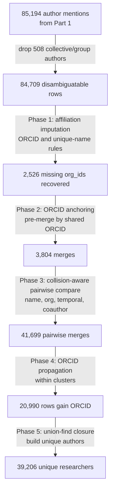

> *Part 3 of the series: **[From Open Source Data to Powerful Insights on Cystic Fibrosis Research Collaboration](/blog/cf-research-network-analysis/)***

---

## The Author Identity Problem

In PubMed, authors are identified by name. Not by a unique ID, not by an account number. Just their name as it appears on the paper. This is the [entity resolution](https://en.wikipedia.org/wiki/Record_linkage) problem: figuring out which records in a database refer to the same real-world person. It cuts two opposite ways:

1. **Name collisions**: "Wang, X" matches 4 different researchers. "Zhang, L" matches 3. Genuinely different people, same last name and initial.
2. **Name variants**: "Gökçen" and "Gokcen" are the same person with and without Turkish diacritics. "Silva-Filho" and "Silva Filho" are the same person with and without a hyphen. "Greg", "Gregory", and "Gregory S" are the same person at three levels of name completeness.

Part 1 left off with 85,194 author mentions attached to the 11,500 articles in the filtered CF corpus. Those mentions reduce to **42,949 unique (last name, first name, initials) combinations**. Some unknown fraction of those are duplicates. Some are collisions. The job of this post is to figure out which is which.

## What 42,949 Name Combinations Actually Look Like

Here are four real shapes of the problem, taken directly from the data:

```
"Gökçen"            ≈ "Gokcen"             # Turkish diacritics stripped in one record
"Silva-Filho"       ≈ "Silva Filho"        # hyphen gone
"Tana Aslan, Ayse"  ≈ "Aslan, Ayse Tana"   # first/last name order swap
"Greg", "Gregory", "Gregory S"             # three completeness levels, one person
```

```
"Wang, X"   # 4 different real researchers
"Zhang, L"  # 3 different real researchers
"Kim, J"    # 3 different real researchers
```

The first block is the merge problem: if we do not unify these variants, a single researcher fractures into several graph nodes and their real collaborations vanish. The second block is the split problem: if we merge them naively, one graph node ends up representing four different people and their research groups get illegally stitched together. For a co-authorship network, **false positives are worse than false negatives**. A wrong merge creates fake connections between unrelated research groups. A missed merge means one person shows up as two nodes, which is not ideal but not destructive.

---

## Why Simple Name Matching Plateaus

Before arriving at a concrete method, I walked through a ladder of progressively more sophisticated strategies and scored each one against an ORCID-based ground truth (any two records sharing an ORCID must end up in the same cluster). The ceiling turns out to be surprisingly easy to hit and stubborn to push past.

| Strategy | F1 | What it misses |
|---|:---:|---|
| Exact name only | 0.918 | Cannot handle diacritics, hyphens, typos, or variant spellings |
| Fuzzy name only | 0.968 | False positives on high-collision surnames (Wang X, Zhang L) |
| Name + affiliation text | 0.955 | Affiliation text is noisy; researchers who move get split |
| Name + affiliation + co-authors | 0.958 | Still splits anyone who changed institutions |
| Collision-aware name + `org_id` + co-authors | **0.967** | Best we can do without knowing anything about time |

Every one of those strategies is bottlenecked by the same blind spot: **researchers change institutions**. Until the algorithm understood publication dates, the ceiling was F1=0.967 and the errors underneath it were all the same kind of mistake. 150 real people, confirmed by matching ORCIDs, split across two or more clusters because the algorithm refused to merge records from different `org_id` values.

That is the gap that temporal intelligence closes.

---

## The Signals I Actually Used

Before the signals themselves, one quick bit of schema setup. [Part 2]() resolved every affiliation to a canonical Google Place ID. I carry that value through to each author row as a field called `org_id`. Two records that share an `org_id` are at the exact same physical institution, so institution comparisons in this post are always exact matches, never fuzzy string comparisons on affiliation text.

With that out of the way, four signals, ranked by how much we can trust them:

| Signal | Coverage | Role |
|---|:---:|---|
| ORCID | 13.1% of rows (6,293 unique IDs, 14,593 rows) | Anchor for known identities, and ground truth for the evaluation |
| `org_id` (institution) | 91.5% of rows | Exact match on the canonical Place ID, no fuzzy affiliation text needed |
| Name similarity | 100% | Moderate. Handles hyphens, diacritics, prefix matching, first/last swaps |
| Co-author Jaccard overlap | Per pair | Supporting signal for confirming collision-prone matches |

A few notes on why name matching is harder than it looks. Compound last names like "Silva-Filho" get normalized (hyphens out, parts sorted) before comparison. First-name prefix matching has a length guard so that "Mirjam" matches "M" but "Fang" does not match "Fangyu" (the shorter name has to be at least 60% of the longer one to qualify). Unicode normalization via `unidecode()` collapses "Öztürk" to "Ozturk" before any string comparison runs. The final output is a single 0.0 to 1.0 compatibility score that combines a last-name component and a first-name component.

---

## Temporal Intelligence: Researchers Move

Consider Marvin Whiteley. He published from Georgia Tech from 2015 through 2017, then moved to Emory and has published from there ever since (2018 through 2025). Two different `org_id` values, in two different cities, across 18 papers total. Without temporal awareness, the algorithm sees two different institutions and refuses to merge, so Marvin Whiteley becomes two researchers in the network. With temporal awareness, the algorithm sees that the Georgia Tech run ends in 2017 and the Emory run begins in 2018, a clean cross, and concludes this is a career move rather than a name collision.

How common is this? I used the ORCID subset as ground truth for measuring actual mobility over 2015 to 2025:

| Mobility pattern | ORCID researchers | Share |
|---|:---:|:---:|
| Exactly 1 organization | 4,332 | 70.7% |
| 2+ organizations | 1,794 | 29.3% |
| 3+ organizations | 505 | 8.2% |

**Nearly one in three researchers published from more than one institution.** This is not some rare edge case, it is just how academic science works. Those 1,794 multi-org researchers break down into three transition types:

| Pattern | Count | Share | What it looks like |
|---|:---:|:---:|---|
| Overlapping | 1,278 | 71.2% | Both orgs in the same year range, transition period or dual appointment |
| Concurrent | 348 | 19.4% | Sustained dual appointment (hospital + university, for example) |
| Sequential | 168 | 9.4% | A clean move: stopped publishing from org A, then started at org B |

Real examples pulled from the data:

- **Sequential move**: Aykut Eski went from Ege University (2020) to Istanbul University (2025).
- **Overlapping transition**: Racha Khalaf had Johns Hopkins (2019) overlapping with University of Colorado (2019) before settling at University of South Florida (2025).
- **Concurrent appointment**: Abbey Sawyer was at Curtin University, the Institute for Respiratory Health, *and* Sir Charles Gairdner Hospital simultaneously from 2020 to 2021.

For sequential moves specifically, how much time typically passes between the last paper at org A and the first at org B?

| Gap (years) | Share of sequential transitions |
|---|:---:|
| 1 year | 24.4% |
| 2 years | 30.1% |
| 3 years | 18.8% |
| 4 years | 12.5% |
| 5 years | 8.5% |
| 6+ years | 5.7% |

**94.3% of sequential transitions happen within a five-year gap.** That number is not a guess, it calibrates the algorithm directly: two records from different `org_id` values whose publication years are within five years of each other are *temporally compatible*, meaning they *could* be the same person who moved. Beyond five years, temporal compatibility is denied.

---

## The Collision-Aware Decision Logic

With the signals defined, the core of the algorithm is a single decision function, `should_merge(a, b)`, that runs on every candidate pair. Here is the logic in pseudocode:

```python
def should_merge(a, b):
    # Strongest signal: matching email beats everything
    if emails_overlap(a, b):
        return True

    name_score  = name_compatibility(a, b)             # 0.0 to 1.0
    same_org    = (a.org_id == b.org_id)
    temporal_ok = temporal_compatible(a, b, max_gap=5)
    coauth      = coauthor_jaccard(a, b)

    if is_high_collision_surname(a.last_name):
        # Wang, Zhang, Li, Chen, Kim, Patel, Smith, Brown, ...
        # Name alone is never enough. Require a non-name signal.
        if name_score >= 0.95 and same_org:                           return True
        if name_score >= 0.85 and same_org:                           return True
        if name_score >= 0.85 and temporal_ok and coauth >= 0.1:      return True
        if name_score >= 0.85 and coauth >= 0.1:                      return True
        return False

    # Rare surnames: a strong name match can stand on its own
    if name_score >= 0.85:                                            return True
    if name_score >= 0.5 and (same_org or coauth >= 0.1):             return True
    if name_score >= 0.5 and temporal_ok and coauth >= 0.05:          return True
    return False
```

Three things to notice:

1. **The asymmetry is deliberate.** High-collision surnames (around 40 of them: Wang, Zhang, Li, Chen, Kim, Patel, Smith, Brown, and so on) never get to merge on name alone. They always require at least one corroborating signal. Rare names do not need that guard because the base rate of "two unrelated people with the same unusual name" is vanishingly small.
2. **Temporal compatibility is additive, not standalone.** It never triggers a merge by itself. It only opens up the door for a merge that already has a name signal and a co-author signal to go through.
3. **Email is the one hard short-circuit.** If two records share an email, they are the same person full stop, skip everything else.

---

## The Pipeline



Five phases end-to-end:

- **Phase 1: Affiliation imputation.** 9,453 rows from Part 2 are missing an `org_id`. Two safe rules recover 2,526 of them: if the same ORCID appears elsewhere with an `org_id`, reuse it (647 rows); if a (last name, first name) pair maps to exactly one org across the whole dataset, assign that org (1,879 rows). The remaining 6,927 missing-org rows stay untouched because their imputation would be ambiguous.
- **Phase 2: ORCID anchoring.** Every record sharing an ORCID gets pre-merged. 10,097 records have ORCIDs, producing 3,804 merges.
- **Phase 3: Collision-aware pairwise comparison.** Records are blocked by normalized last-name parts to avoid comparing every possible pair (85K × 85K would be 3.6 billion comparisons). Inside each block, every pair gets scored on name, org, temporal, and co-author signals and run through `should_merge()`. 41,699 pairwise merges.
- **Phase 4: ORCID propagation.** Within each cluster, if any record has an ORCID, every record in the cluster inherits it. 20,990 records gain ORCIDs this way, expanding ORCID coverage from 10,097 to 31,087.
- **Phase 5: Build the unique-author table.** All merge decisions feed into a [union-find](https://en.wikipedia.org/wiki/Disjoint-set_data_structure) data structure with path compression, which handles transitive merges automatically (if A and B are merged and B and C are merged, A-B-C automatically end up in the same cluster). Final output: **39,206** unique researchers and a companion table that maps every original author mention to its canonical researcher ID.

---

## Validating Against ORCID Ground Truth

ORCID covers only 13.1% of the raw rows, but those 6,293 IDs are free ground truth. Every pair of records sharing an ORCID is a known correct merge. Every pair with different ORCIDs is a known incorrect merge. Running precision, recall, and F1 on the clustering costs nothing and requires zero hand-labeling.

**Methodology.** The scorer walks every pair inside the predicted clusters. Pairs where both records share an ORCID are true positives. Pairs where both records have different ORCIDs are false positives. ORCID pairs where the algorithm failed to put both records in the same cluster are false negatives. From there, precision, recall, and F1 follow directly.

**The temporal enhancement, before and after:**

| Metric | Without temporal | With temporal |
|---|:---:|:---:|
| Precision | 0.988 | **0.9992** |
| Recall | 0.947 | **1.0000** |
| F1 | 0.967 | **0.9996** |
| False negative ORCIDs (split) | 150 | **0** |
| False positive clusters | 49 | 45 |

The temporal enhancement did not just nudge F1 up. It eliminated every single false negative. Recall went from 0.947 to 1.000. Those 150 researchers whose career moves the earlier strategies refused to merge are all correctly unified now. Precision also improved slightly, because allowing cross-org merges with temporal compatibility turned out to unblock a handful of name-collision fixes too.

**Is cross-org merging actually safe?** I measured this directly. Among ORCID-bearing names that appear at 2+ orgs, 1,778 cases (96.6%) are the same person and 63 cases (3.4%) are genuinely different people. Those 63 are almost entirely high-collision surnames (Kim, Wang, Zhang, Li), which the collision-aware branch of `should_merge()` already catches because those surnames always require a co-author or org signal on top of the name match.

**The 45 remaining false positives are not algorithm errors.** They are ORCID data quality issues: real people who somehow ended up with two different ORCID IDs. Carsten Schwarz has two ORCIDs that both clearly belong to him. John P. Clancy has two. Rasmus Lykke Marvig has a format-variant duplicate. The algorithm is correctly merging what it sees; the ground truth is what is likely wrong.

---

## Results and Mobility Patterns

| Metric | Value |
|---|---|
| Input: author-article appearances | 84,709 |
| Output: unique author IDs | **39,206** |
| Reduction | 53.7% |
| Singletons (one appearance only) | 27,873 |
| Authors with ORCID (after propagation) | 6,247 |
| Largest cluster | 166 articles (Felix Ratjen) |

The mobility breakdown in the final dataset:

| Pattern | Authors | Share |
|---|:---:|:---:|
| Single organization | 29,385 | 75.0% |
| Concurrent affiliations | 8,015 | 20.4% |
| Sequential career move | 1,806 | 4.6% |
| **Total at 2+ orgs** | **9,821** | **25.0%** |

Every author's record includes a full affiliation timeline (every `org_id` they published from, along with the year range), which makes longitudinal analysis of career trajectories possible across the entire research community.

---

## The Most Prolific CF Researchers

| Author | Articles | Orgs | Years Active |
|---|:---:|:---:|:---:|
| Felix A. Ratjen | 166 | 6 | 2015-2025 |
| Christopher H. Goss | 136 | 13 | 2015-2025 |
| Marcus A. Mall | 127 | 42 | 2015-2025 |
| Isabelle Sermet-Gaudelus | 123 | 35 | 2015-2025 |
| Jane C. Davies | 122 | 26 | 2015-2025 |

The high org counts for the top researchers reflect multi-institutional clinical trials. A single trial paper can list 30+ institutional affiliations on a single author. Marcus Mall did not actually work at 42 different places.

---

## The Clean Dataset

The final output is a normalized, relational dataset ready for network analysis.

**Entity tables:**
- 11,500 publications with title, abstract, journal, year, and MeSH terms
- 39,206 disambiguated authors with canonical names, ORCIDs, and affiliation timelines
- 5,799 research organizations with coordinates and categories

**Relationship tables:**
- 84,709 publication-to-author links (with author position)
- 53,689 author-to-organization links (with year ranges)
- 37,832 publication-to-organization links
- 138,062 publication-to-MeSH term links (with major/minor flags)

Every foreign key validated. Zero orphan records. Ready for graph construction.

---

## Lessons Learned

A few things that were not obvious going in:

1. **Temporal awareness is the one trick that unlocked recall.** Every strategy I tried topped out around F1=0.967 because it kept refusing to merge researchers who had moved institutions. A five-year gap rule calibrated from the actual ORCID mobility data pushed recall from 0.947 all the way to 1.000 and gave back those 150 lost identities.
2. **High-collision surnames need a different rule, not a stricter threshold.** Wang, Zhang, Li, Kim: demanding a higher name similarity score does nothing, because the names are already identical. The only thing that helps is requiring a non-name signal (same org, or co-author overlap) alongside the name match.
3. **Some of the eval "errors" are not algorithm errors.** The 45 remaining false positive clusters turned out to be cases where one real person somehow has two different ORCID IDs. Knowing the difference between "my algorithm is wrong" and "my ground truth is wrong" mattered for knowing when to stop iterating and ship.

---

## What's Next

With 39,206 disambiguated researchers and their full affiliation timelines in hand, the raw material for the CF co-authorship network is finally ready. Part 4 builds the network, measures its structure, and finds the small set of bridge-building researchers who connect the entire community.

---

*Next: [Part 4: The Small World of CF Research]()*
